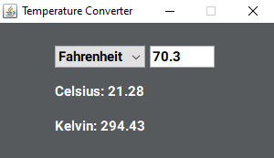

# temperature-converter
A Java GUI that allows you to convert temperatures

My first ever thing I made with Java Swing GUI

Converts between Celsius, Fahrenheit, and Kelvin accurately rounded to 2 decimal points
